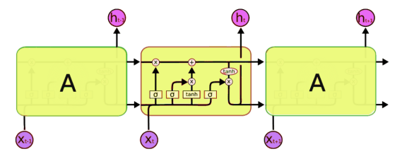
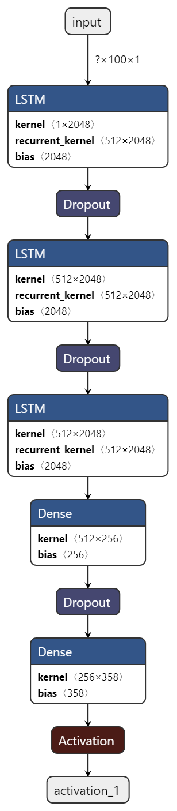

# Problem Statement 

Our task here is to take some existing music data then train a model using this existing data. The model has to learn the patterns in music that we humans enjoy. Once it learns this, the model should be able to generate new music for us. It cannot simply copy-paste from the training data. It has to understand the patterns of music to generate new music. We here are not expecting our model to generate new music which is of professional quality, but we want it to generate a decent quality music which should be melodious and good to hear.

## Understanding the Data

The Input data we are using for developing the model is from **.mid** file. Let's gain some domain Knowledge. 

A MIDI file is not an audio recording. Rather, it is a set of instructions – for example, for pitch or tempo – and can use a thousand times less disk space than the equivalent recorded audio.

To process these files we use **Music21**


Music21 is a Python-based toolkit for computer-aided musicology.

People use music21 to answer questions from musicology using computers, to study large datasets of music, to generate musical examples, to teach fundamentals of music theory, to edit musical notation, study music and the brain, and to compose music (both algorithmically and directly).

> pip install music21

**Importing the necessary Libraries**


```python
from music21 import converter, instrument, note, chord
import glob
import pickle
import numpy as np
import pandas as pd
from keras.utils import np_utils
from keras.models import Sequential
from keras.layers import LSTM, Dense, Dropout, Activation
from keras.callbacks import ModelCheckpoint
from keras.utils import plot_model
import os
```

## Extracting the data from music notes

The .mid files are stored in music_notes folder and we are implementing the below code to extract the data from each file and store it in notes list. **music21** library modules are utilized for parsing the files


```python
notes=[]

for file in glob.glob('midi_songs/*.mid'):
    midi=converter.parse(file)
    print("Parsing %s" % file)
    notes_to_parse=None
    
    parts=instrument.partitionByInstrument(midi)
    
    if parts:
        notes_to_parse=parts.parts[0].recurse()
    else:
        notes_to_parse=midi.flat.notes
        
    for element in notes_to_parse:
        if isinstance(element,note.Note):
            notes.append(str(element.pitch))
        elif isinstance(element, chord.Chord):
            notes.append('.'.join(str(n) for n in element.normalOrder))
```

    Parsing midi_songs\0fithos.mid
    Parsing midi_songs\8.mid
    Parsing midi_songs\ahead_on_our_way_piano.mid
    Parsing midi_songs\AT.mid
    Parsing midi_songs\balamb.mid
    Parsing midi_songs\bcm.mid
    Parsing midi_songs\BlueStone_LastDungeon.mid
    Parsing midi_songs\braska.mid
    Parsing midi_songs\caitsith.mid
    Parsing midi_songs\Cids.mid
    Parsing midi_songs\cosmo.mid
    Parsing midi_songs\costadsol.mid
    Parsing midi_songs\dayafter.mid
    Parsing midi_songs\decisive.mid
    Parsing midi_songs\dontbeafraid.mid
    Parsing midi_songs\DOS.mid
    Parsing midi_songs\electric_de_chocobo.mid
    Parsing midi_songs\Eternal_Harvest.mid
    Parsing midi_songs\EyesOnMePiano.mid
    Parsing midi_songs\ff11_awakening_piano.mid
    Parsing midi_songs\ff1battp.mid
    Parsing midi_songs\FF3_Battle_(Piano).mid
    Parsing midi_songs\FF3_Third_Phase_Final_(Piano).mid
    Parsing midi_songs\ff4-airship.mid
    Parsing midi_songs\Ff4-BattleLust.mid
    Parsing midi_songs\ff4-fight1.mid
    Parsing midi_songs\ff4-town.mid
    Parsing midi_songs\FF4.mid
    Parsing midi_songs\ff4pclov.mid
    Parsing midi_songs\ff4_piano_collections-main_theme.mid
    Parsing midi_songs\FF6epitaph_piano.mid
    Parsing midi_songs\ff6shap.mid
    Parsing midi_songs\Ff7-Cinco.mid
    Parsing midi_songs\Ff7-Jenova_Absolute.mid
    Parsing midi_songs\ff7-mainmidi.mid
    Parsing midi_songs\Ff7-One_Winged.mid
    Parsing midi_songs\ff7themep.mid
    Parsing midi_songs\ff8-lfp.mid
    Parsing midi_songs\FF8_Shuffle_or_boogie_pc.mid
    Parsing midi_songs\FFIII_Edgar_And_Sabin_Piano.mid
    Parsing midi_songs\FFIXQuMarshP.mid
    Parsing midi_songs\FFIX_Piano.mid
    Parsing midi_songs\FFVII_BATTLE.mid
    Parsing midi_songs\FFX_-_Ending_Theme_(Piano_Version)_-_by_Angel_FF.mid
    Parsing midi_songs\Fiend_Battle_(Piano).mid
    Parsing midi_songs\Fierce_Battle_(Piano).mid
    Parsing midi_songs\figaro.mid
    Parsing midi_songs\Finalfantasy5gilgameshp.mid
    Parsing midi_songs\Finalfantasy6fanfarecomplete.mid
    Parsing midi_songs\Final_Fantasy_7_-_Judgement_Day_Piano.mid
    Parsing midi_songs\Final_Fantasy_Matouyas_Cave_Piano.mid
    Parsing midi_songs\fortresscondor.mid
    Parsing midi_songs\Fyw_piano.mid
    Parsing midi_songs\gerudo.mid
    Parsing midi_songs\goldsaucer.mid
    Parsing midi_songs\Gold_Silver_Rival_Battle.mid
    Parsing midi_songs\great_war.mid
    Parsing midi_songs\HighwindTakestotheSkies.mid
    Parsing midi_songs\In_Zanarkand.mid
    Parsing midi_songs\JENOVA.mid
    Parsing midi_songs\Kingdom_Hearts_Dearly_Beloved.mid
    Parsing midi_songs\Kingdom_Hearts_Traverse_Town.mid
    Parsing midi_songs\Life_Stream.mid
    Parsing midi_songs\lurk_in_dark.mid
    Parsing midi_songs\mining.mid
    Parsing midi_songs\Oppressed.mid
    Parsing midi_songs\OTD5YA.mid
    Parsing midi_songs\path_of_repentance.mid
    Parsing midi_songs\pkelite4.mid
    Parsing midi_songs\Rachel_Piano_tempofix.mid
    Parsing midi_songs\redwings.mid
    Parsing midi_songs\relmstheme-piano.mid
    Parsing midi_songs\roseofmay-piano.mid
    Parsing midi_songs\rufus.mid
    Parsing midi_songs\Rydia_pc.mid
    Parsing midi_songs\sandy.mid
    Parsing midi_songs\sera_.mid
    Parsing midi_songs\sobf.mid
    Parsing midi_songs\Still_Alive-1.mid
    Parsing midi_songs\Suteki_Da_Ne_(Piano_Version).mid
    Parsing midi_songs\thenightmarebegins.mid
    Parsing midi_songs\thoughts.mid
    Parsing midi_songs\tifap.mid
    Parsing midi_songs\tpirtsd-piano.mid
    Parsing midi_songs\traitor.mid
    Parsing midi_songs\ultimafro.mid
    Parsing midi_songs\ultros.mid
    Parsing midi_songs\VincentPiano.mid
    Parsing midi_songs\ViviinAlexandria.mid
    Parsing midi_songs\waltz_de_choco.mid
    Parsing midi_songs\Zelda_Overworld.mid
    Parsing midi_songs\z_aeristhemepiano.mid
    


```python
notes[1:20]
```


    ['E2',
     '4.9',
     '4.9',
     '4.9',
     '4.9',
     '4.9',
     '4.9',
     '4.9',
     '11.4',
     '4.9',
     '11.4',
     '4.9',
     '4.9',
     '4.9',
     '4.9',
     '4.9',
     '0.4',
     'E2',
     '4.9']


```python
len(set(notes))
```


    358


**saving the data in notes file for futher reuse**


```python
with open('notes', 'wb') as filepath:
        pickle.dump(notes, filepath)
```

## Data preprocessing


The Neural network we are creating has LSTM Layers after Input Layer. we need to prepare our data as per it's requirement. At present our data is just a list of notes. We need to create a list of sequences as features and  list of their next note as Target variable

Ex: 

A sequence with increment 10

10,20,30,40,50,60


If we take 3 steps and and our data has single feature

|x  | y           
--- | --- 
| 10 20 30|40
|20 30 40 |50
|30 40 50  | 60

and If we give 40,50,60 our model has to predict output as 70.


Our data example:

suppose we have only four notes. Let them be A, B, C, D

and input sequence is AABACCDB

we will create dictionary mapping them to integers

|A|B|C|D
---|---|---|---
0|1|2|3

Now our input sequence became 00102231

Now we will create a list of sequences X

|x  | y           
--- | --- 
| 0 0 1|0
|0 1 0 |2
|1 0 2  |2
|0 2 2 | 3  
|2  2  3|1 

Now Y is one hot encoded.


|x  | y           
--- | --- 
| 0 0 1|0 0 0 0
|0 1 0 |0 0 1 0
|1 0 2  |0 0 1 0
|0 2 3 | 0 0 0 1
|2 3 4|0 1 0 0


```python
seq_length=100
pitchnames=sorted(set(item for item in notes))
```

**Creating a dictionary mapping the pitched to integers**


```python
n_vocab=len(set(notes))

sequence_length = 100
# get all pitch names
pitchnames = sorted(set(item for item in notes))
# create a dictionary to map pitches to integers
note_to_int = dict((note, number) for number, note in enumerate(pitchnames))
network_input = []
network_output = []
# create input sequences and the corresponding outputs
for i in range(0, len(notes) - sequence_length, 1):
    sequence_in = notes[i:i + sequence_length]
    sequence_out = notes[i + sequence_length]
    network_input.append([note_to_int[char] for char in sequence_in])
    network_output.append(note_to_int[sequence_out])
n_patterns = len(network_input)
# reshape the input into a format compatible with LSTM layers
network_input = np.reshape(network_input, (n_patterns, sequence_length, 1))
# normalize input
network_input = network_input / float(n_vocab)
network_output = np_utils.to_categorical(network_output)
```


```python
network_input.shape
```


    (57077, 100, 1)


```python
network_output.shape
```


    (57077, 358)


## Model Building


Our model will take 100 notes and predict the 101 one and and now 102 note is produced by feeding 2-101 notes and so on...

Key Layer for our model is LSTM. Let's know a little bit about it.

### LSTM




1. Forget Gate

**Bob is nice person but Alice is evil**

As soon as the first full stop after “person” is encountered, the forget gate realizes that there may be a change of context in the next sentence. As a result of this, the subject of the sentence is forgotten and the place for the subject is vacated. And when we start speaking about “Dan” this position of the subject is allocated to “Dan”. This process of forgetting the subject is brought about by the forget gate.

2. Input Gate

**Bob knows swimming. He told me over the phone that he served for navy for 4 years**

Now the important information here is that “Bob” knows swimming and that he has served the Navy for four years. This can be added to the cell state, however, the fact that he told all this over the phone is a less important fact and can be ignored. This process of adding some new information can be done via the input gate.

3. Output Gate

**Bob fought single handedly with the enemy and died for his country. For his contributions brave____________**

In this phrase, there could be a number of options for the empty space. But we know that the current input of ‘brave’, is an adjective that is used to describe a noun. Thus, whatever word follows, has a strong tendency of being a noun. And thus, Bob could be an apt output.

This job of selecting useful information from the current cell state and showing it out as an output is done via the output gate. 


```python
model = Sequential()
model.add(LSTM(
    512,
    input_shape=(network_input.shape[1], network_input.shape[2]),
    return_sequences=True
))
model.add(Dropout(0.3))
model.add(LSTM(512, return_sequences=True))
model.add(Dropout(0.3))
model.add(LSTM(512))
model.add(Dense(256))
model.add(Dropout(0.3))
model.add(Dense(n_vocab))
model.add(Activation('softmax'))
model.compile(loss='categorical_crossentropy', optimizer='rmsprop')

```

    WARNING:tensorflow:From /usr/local/lib/python3.6/dist-packages/tensorflow/python/framework/op_def_library.py:263: colocate_with (from tensorflow.python.framework.ops) is deprecated and will be removed in a future version.
    Instructions for updating:
    Colocations handled automatically by placer.
    WARNING:tensorflow:From /usr/local/lib/python3.6/dist-packages/keras/backend/tensorflow_backend.py:3445: calling dropout (from tensorflow.python.ops.nn_ops) with keep_prob is deprecated and will be removed in a future version.
    Instructions for updating:
    Please use `rate` instead of `keep_prob`. Rate should be set to `rate = 1 - keep_prob`.
    

## Training the model


```python
filepath='my_weights-improvement={epoch:02d}-{loss:.4f}-bigger.hdf5'
checkpoint=ModelCheckpoint(filepath,monitor='loss',verbose=0,save_best_only=True,mode='min')
callbacks_list=[checkpoint]

model.fit(net_input,net_output,epochs=100,batch_size=128,callbacks=callbacks_list)
```

    WARNING:tensorflow:From /usr/local/lib/python3.6/dist-packages/tensorflow/python/ops/math_ops.py:3066: to_int32 (from tensorflow.python.ops.math_ops) is deprecated and will be removed in a future version.
    Instructions for updating:
    Use tf.cast instead.
    Epoch 1/100
    57077/57077 [==============================] - 584s 10ms/step - loss: 4.7701
    Epoch 2/100
    57077/57077 [==============================] - 573s 10ms/step - loss: 4.7976
    Epoch 3/100
    57077/57077 [==============================] - 571s 10ms/step - loss: 4.7119
    Epoch 4/100
    57077/57077 [==============================] - 569s 10ms/step - loss: 4.7356
    Epoch 5/100
    57077/57077 [==============================] - 568s 10ms/step - loss: 4.7034
    Epoch 6/100
    57077/57077 [==============================] - 568s 10ms/step - loss: 4.7244
    Epoch 7/100
    57077/57077 [==============================] - 565s 10ms/step - loss: 4.7030
    Epoch 8/100
    57077/57077 [==============================] - 567s 10ms/step - loss: 4.6946
    Epoch 9/100
    57077/57077 [==============================] - 566s 10ms/step - loss: 4.6919
    Epoch 10/100
    57077/57077 [==============================] - 565s 10ms/step - loss: 4.6375
    Epoch 11/100
    57077/57077 [==============================] - 565s 10ms/step - loss: 4.5706
    Epoch 12/100
    57077/57077 [==============================] - 563s 10ms/step - loss: 4.5414
    Epoch 13/100
    38528/57077 [===================>..........] - ETA: 3:03 - loss: 4.6084


```python
len(set(notes))
```


    358


## reloading the weights 


```python
model.load_weights('my_weights-improvement=100-0.2741-bigger.hdf5')
```




```python
model.summary()
```

    _________________________________________________________________
    Layer (type)                 Output Shape              Param #   
    =================================================================
    lstm_1 (LSTM)                (None, 100, 512)          1052672   
    _________________________________________________________________
    dropout_1 (Dropout)          (None, 100, 512)          0         
    _________________________________________________________________
    lstm_2 (LSTM)                (None, 100, 512)          2099200   
    _________________________________________________________________
    dropout_2 (Dropout)          (None, 100, 512)          0         
    _________________________________________________________________
    lstm_3 (LSTM)                (None, 512)               2099200   
    _________________________________________________________________
    dense_1 (Dense)              (None, 256)               131328    
    _________________________________________________________________
    dropout_3 (Dropout)          (None, 256)               0         
    _________________________________________________________________
    dense_2 (Dense)              (None, 358)               92006     
    _________________________________________________________________
    activation_1 (Activation)    (None, 358)               0         
    =================================================================
    Total params: 5,474,406
    Trainable params: 5,474,406
    Non-trainable params: 0
    _________________________________________________________________
    

## Training the already trained one for futher Improvements


```python
filepath='weights_folder/my_weights-improvement={epoch:02d}-{loss:.4f}-bigger.hdf5'
checkpoint=ModelCheckpoint(filepath,monitor='loss',verbose=0,save_best_only=True,mode='min')
callbacks_list=[checkpoint]
model.fit(net_input,net_output,epochs=200,batch_size=128,callbacks=callbacks_list)
```

    Epoch 1/200
    57077/57077 [==============================] - 562s 10ms/step - loss: 0.2689
    Epoch 2/200
    57077/57077 [==============================] - 562s 10ms/step - loss: 0.2668
    Epoch 3/200
    57077/57077 [==============================] - 561s 10ms/step - loss: 0.2543
    Epoch 4/200
    57077/57077 [==============================] - 561s 10ms/step - loss: 0.2554
    Epoch 5/200
    57077/57077 [==============================] - 562s 10ms/step - loss: 0.2508
    Epoch 6/200
    57077/57077 [==============================] - 563s 10ms/step - loss: 0.2518
    Epoch 7/200
    57077/57077 [==============================] - 562s 10ms/step - loss: 0.2478
    Epoch 8/200
    57077/57077 [==============================] - 563s 10ms/step - loss: 0.2414
    Epoch 9/200
    57077/57077 [==============================] - 564s 10ms/step - loss: 0.2404
    Epoch 10/200
    57077/57077 [==============================] - 562s 10ms/step - loss: 0.2396
    Epoch 11/200
    57077/57077 [==============================] - 562s 10ms/step - loss: 0.2312
    Epoch 12/200
    57077/57077 [==============================] - 562s 10ms/step - loss: 0.2267
    Epoch 13/200
    57077/57077 [==============================] - 561s 10ms/step - loss: 0.2219
    Epoch 14/200
    57077/57077 [==============================] - 562s 10ms/step - loss: 0.2239
    Epoch 15/200
    57077/57077 [==============================] - 562s 10ms/step - loss: 0.2198
    Epoch 16/200
    57077/57077 [==============================] - 561s 10ms/step - loss: 0.2158
    Epoch 17/200
    57077/57077 [==============================] - 562s 10ms/step - loss: 0.2112
    Epoch 18/200
    57077/57077 [==============================] - 561s 10ms/step - loss: 0.2125
    Epoch 19/200
    57077/57077 [==============================] - 562s 10ms/step - loss: 0.2071
    Epoch 20/200
    57077/57077 [==============================] - 563s 10ms/step - loss: 0.2042
    Epoch 21/200
    57077/57077 [==============================] - 561s 10ms/step - loss: 0.2061
    Epoch 22/200
    57077/57077 [==============================] - 561s 10ms/step - loss: 0.2031
    Epoch 23/200
    57077/57077 [==============================] - 562s 10ms/step - loss: 0.2009
    Epoch 24/200
    57077/57077 [==============================] - 561s 10ms/step - loss: 0.2001
    Epoch 25/200
    57077/57077 [==============================] - 562s 10ms/step - loss: 0.1974
    Epoch 26/200
    57077/57077 [==============================] - 561s 10ms/step - loss: 0.1915
    Epoch 27/200
    57077/57077 [==============================] - 562s 10ms/step - loss: 0.1932
    Epoch 28/200
    57077/57077 [==============================] - 562s 10ms/step - loss: 0.1932
    Epoch 29/200
    57077/57077 [==============================] - 562s 10ms/step - loss: 0.1868
    Epoch 30/200
    57077/57077 [==============================] - 563s 10ms/step - loss: 0.1876
    Epoch 31/200
    57077/57077 [==============================] - 563s 10ms/step - loss: 0.1874
    Epoch 32/200
    57077/57077 [==============================] - 562s 10ms/step - loss: 0.1885
    Epoch 33/200
    57077/57077 [==============================] - 563s 10ms/step - loss: 0.1859
    Epoch 34/200
    57077/57077 [==============================] - 561s 10ms/step - loss: 0.1798
    Epoch 35/200
    57077/57077 [==============================] - 561s 10ms/step - loss: 0.1852
    Epoch 36/200
    57077/57077 [==============================] - 561s 10ms/step - loss: 0.1822
    Epoch 37/200
    57077/57077 [==============================] - 563s 10ms/step - loss: 0.1816
    Epoch 38/200
    57077/57077 [==============================] - 562s 10ms/step - loss: 0.1803
    Epoch 39/200
    57077/57077 [==============================] - 562s 10ms/step - loss: 0.1771
    Epoch 40/200
    57077/57077 [==============================] - 563s 10ms/step - loss: 0.1728
    Epoch 41/200
    57077/57077 [==============================] - 562s 10ms/step - loss: 0.1737
    Epoch 42/200
    57077/57077 [==============================] - 562s 10ms/step - loss: 0.1758
    Epoch 43/200
    57077/57077 [==============================] - 562s 10ms/step - loss: 0.1714
    Epoch 44/200
    57077/57077 [==============================] - 563s 10ms/step - loss: 0.1721
    Epoch 45/200
    57077/57077 [==============================] - 562s 10ms/step - loss: 0.1713
    Epoch 46/200
    57077/57077 [==============================] - 562s 10ms/step - loss: 0.1700
    Epoch 47/200
    57077/57077 [==============================] - 562s 10ms/step - loss: 0.1653
    Epoch 48/200
    57077/57077 [==============================] - 562s 10ms/step - loss: 0.1686
    Epoch 49/200
    57077/57077 [==============================] - 563s 10ms/step - loss: 0.1721
    Epoch 50/200
    57077/57077 [==============================] - 562s 10ms/step - loss: 0.1642
    Epoch 51/200
    57077/57077 [==============================] - 562s 10ms/step - loss: 0.1642
    Epoch 52/200
    57077/57077 [==============================] - 562s 10ms/step - loss: 0.1648
    Epoch 53/200
    57077/57077 [==============================] - 562s 10ms/step - loss: 0.1574
    Epoch 54/200
    57077/57077 [==============================] - 561s 10ms/step - loss: 0.1603
    Epoch 55/200
    57077/57077 [==============================] - 561s 10ms/step - loss: 0.1658
    Epoch 56/200
    57077/57077 [==============================] - 562s 10ms/step - loss: 0.1582
    Epoch 57/200
    57077/57077 [==============================] - 561s 10ms/step - loss: 0.1589
    Epoch 58/200
    57077/57077 [==============================] - 562s 10ms/step - loss: 0.1620
    Epoch 59/200
    57077/57077 [==============================] - 561s 10ms/step - loss: 0.1550
    Epoch 60/200
    57077/57077 [==============================] - 559s 10ms/step - loss: 0.1588
    Epoch 61/200
    57077/57077 [==============================] - 554s 10ms/step - loss: 0.1584
    Epoch 62/200
    57077/57077 [==============================] - 570s 10ms/step - loss: 0.1537
    Epoch 63/200
    57077/57077 [==============================] - 574s 10ms/step - loss: 0.1556
    Epoch 64/200
    57077/57077 [==============================] - 569s 10ms/step - loss: 0.1540
    Epoch 65/200
    57077/57077 [==============================] - 561s 10ms/step - loss: 0.1529
    Epoch 66/200
    57077/57077 [==============================] - 563s 10ms/step - loss: 0.1564
    Epoch 67/200
    57077/57077 [==============================] - 563s 10ms/step - loss: 0.1526
    Epoch 68/200
    57077/57077 [==============================] - 563s 10ms/step - loss: 0.1574
    Epoch 69/200
    57077/57077 [==============================] - 563s 10ms/step - loss: 0.1565
    Epoch 70/200
    57077/57077 [==============================] - 562s 10ms/step - loss: 0.1510
    Epoch 71/200
    57077/57077 [==============================] - 562s 10ms/step - loss: 0.1495
    Epoch 72/200
    57077/57077 [==============================] - 561s 10ms/step - loss: 0.1489
    Epoch 73/200
    57077/57077 [==============================] - 562s 10ms/step - loss: 0.1484
    Epoch 74/200
    39936/57077 [===================>..........] - ETA: 2:48 - loss: 0.1467

## Saving the model and Model Graph


```python
# Save the model
model.save('music_generator.h5')
plot_model(model, to_file='model.png')
```
